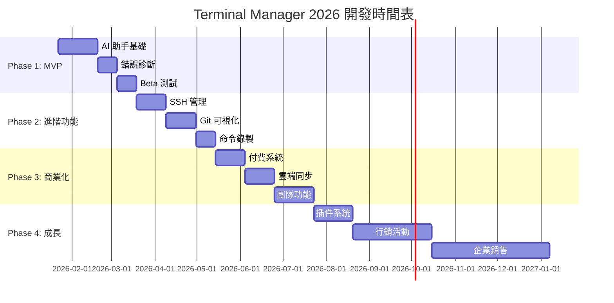

# Terminal Manager 商業化計劃書

> **版本**: v1.0
> **日期**: 2026-01-22
> **狀態**: 規劃階段
> **目標**: 打造華語市場領先的專業終端應用

---

## 📋 執行摘要

### 產品定位
Terminal Manager 是一款**跨平台、AI 增強的專業終端應用**，專注於華語市場，提供：
- 🤖 **AI 終端助手**：自然語言轉命令
- 🌐 **SSH 會話管理**：企業級遠端連線
- 📊 **Git 可視化**：開發者友好
- 🎨 **精美主題系統**：50+ 專業主題

### 市場機會
- 全球終端應用市場：**$500M+** (2026)
- 華語開發者：**5M+** 潛在用戶
- 競爭對手缺口：**無繁體中文優化的專業終端**
- AI 增強終端：**藍海市場**（Warp 年收入 $10M+）

### 收益預測
| 年度 | 用戶數 | 付費用戶 | 年收入 (ARR) |
|------|--------|----------|--------------|
| Y1   | 10,000 | 300      | $36,000      |
| Y2   | 30,000 | 900      | $120,000     |
| Y3   | 100,000| 3,000    | $400,000     |

---

## 🎯 產品策略

### 核心功能矩陣

| 功能 | 免費版 | Pro 版 ($9.99/月) | Team 版 ($19.99/用戶) |
|------|--------|-------------------|----------------------|
| **基礎功能** |
| 多標籤終端 | 最多 10 個 | ✅ 無限 | ✅ 無限 |
| 分屏模式 | ✅ | ✅ | ✅ |
| 基礎主題 | 5 個 | ✅ 50+ | ✅ 50+ |
| 快捷鍵自訂 | ✅ | ✅ | ✅ |
| 本地會話保存 | ✅ | ✅ | ✅ |
| **AI 功能** |
| AI 終端助手 | ❌ | ✅ 500次/月 | ✅ 無限 |
| 智能命令補全 | ❌ | ✅ | ✅ |
| 錯誤診斷建議 | ❌ | ✅ | ✅ |
| **進階功能** |
| SSH 會話管理 | ❌ | ✅ 20個 | ✅ 無限 |
| Git 可視化 | ❌ | ✅ | ✅ |
| 命令錄製回放 | ❌ | ✅ | ✅ |
| 剪貼板歷史 | 10 條 | ✅ 無限 | ✅ 無限 |
| 雲端同步 | ❌ | ✅ | ✅ |
| **企業功能** |
| 團隊共享設定 | ❌ | ❌ | ✅ |
| 集中憑證管理 | ❌ | ❌ | ✅ |
| 審計日誌 | ❌ | ❌ | ✅ |
| SSO 集成 | ❌ | ❌ | ✅ |
| 優先支援 | ❌ | Email | SLA 保證 |

---

## 🤖 AI 助手功能詳解

### 1. 核心功能

#### A. 自然語言轉命令
```
用戶輸入：「找出這個目錄下最大的 10 個文件」
AI 輸出：
  命令: du -ah . | sort -rh | head -n 10
  解釋: 列出當前目錄所有文件大小，按從大到小排序，顯示前 10 個

  [執行] [複製] [解釋更多]
```

#### B. 智能錯誤診斷
```
終端輸出：
  bash: npm: command not found

AI 自動分析：
  ❌ 問題：npm 未安裝或不在 PATH 中

  💡 建議解決方案：
  1. 安裝 Node.js (包含 npm)
     macOS: brew install node
     Ubuntu: sudo apt install nodejs npm
     Windows: 下載 https://nodejs.org

  2. 檢查 PATH 是否包含 npm
     echo $PATH

  [自動執行方案 1] [了解更多]
```

#### C. 上下文感知補全
```
用戶輸入：「git」
AI 檢測當前目錄是 Git 倉庫，建議：

  📊 當前狀態：
  - 分支：main
  - 未提交文件：3 個
  - 未推送提交：2 個

  🎯 常用操作：
  1. git status          查看狀態
  2. git add .           暫存所有更改
  3. git commit -m "..." 提交
  4. git push            推送到遠端

  [選擇操作]
```

### 2. 差異化優勢

#### vs Warp Terminal

| 功能 | Warp | 我們的優勢 |
|------|------|-----------|
| **語言支持** | 僅英文 | ✅ 繁中優先，理解台灣/中文命令習慣 |
| **離線模式** | 需要聯網 | ✅ 本地模型 + 雲端混合（可離線） |
| **價格** | $12/月 | ✅ $9.99/月（便宜 20%） |
| **隱私** | 命令上傳雲端 | ✅ 選項：完全本地處理 |
| **客製化** | 有限 | ✅ 開放 API，支援自訂 AI 提供者 |
| **多模型支持** | 僅自家模型 | ✅ Claude/GPT/本地 LLM 任選 |

#### 核心競爭力

**1. 混合智能架構**
```javascript
// 本地快速處理 + 雲端深度分析
const AIAssistant = {
  // Tier 1: 本地規則引擎（<10ms）
  localRules: {
    'npm install': '安裝專案依賴',
    'git push': '推送到遠端倉庫',
    // 10,000+ 常用命令庫
  },

  // Tier 2: 本地小模型（<100ms）
  localLLM: 'phi-3-mini', // 3.8B 參數，佔用 2GB RAM

  // Tier 3: 雲端大模型（按需）
  cloudLLM: {
    provider: 'anthropic',
    model: 'claude-3-5-sonnet',
    fallback: 'claude-3-5-haiku' // 省成本
  }
};
```

**2. 上下文整合**
```javascript
// 收集終端上下文，提供更精準建議
const contextData = {
  os: 'darwin',                    // 作業系統
  shell: 'zsh',                    // Shell 類型
  cwd: '/Users/dev/my-project',   // 當前目錄
  files: ['package.json', 'src/'], // 目錄內容
  gitBranch: 'main',               // Git 狀態
  recentCommands: [                 // 最近命令
    'npm run dev',
    'git status'
  ],
  installedTools: [                 // 已安裝工具
    'node', 'npm', 'git', 'docker'
  ],
  lastError: 'ECONNREFUSED'        // 最後錯誤
};

// AI 利用這些上下文提供精準建議
```

**3. 學習型系統**
```javascript
// 記住用戶偏好，越用越聰明
const userProfile = {
  preferredCommands: {
    '部署': 'npm run build && npm run deploy',
    '測試': 'npm test -- --coverage'
  },

  customAliases: {
    'gs': 'git status',
    'gp': 'git push'
  },

  frequentPaths: [
    '/Users/dev/work/project-a',
    '/Users/dev/personal/blog'
  ],

  // 從歷史學習模式
  patterns: {
    morning: ['git pull', 'npm install'],
    deploy: ['npm test', 'git push', 'deploy.sh']
  }
};
```

---

## 🚀 技術實現路線圖

### Phase 1: AI 助手 MVP (4 週)

#### Week 1-2: 基礎架構
```javascript
// 1. 整合 Anthropic SDK
import Anthropic from '@anthropic-ai/sdk';

export class AIService {
  constructor(apiKey) {
    this.client = new Anthropic({ apiKey });
    this.conversationHistory = [];
  }

  async getCommandSuggestion(input, context) {
    const systemPrompt = `你是一個專業的終端助手。

作業系統: ${context.os}
當前 Shell: ${context.shell}
工作目錄: ${context.cwd}
已安裝工具: ${context.tools.join(', ')}

請將用戶的自然語言需求轉換為準確的終端命令。
回應格式：
{
  "command": "實際命令",
  "explanation": "簡短解釋",
  "alternatives": ["替代方案1", "替代方案2"],
  "warnings": "安全警告（如適用）"
}`;

    const message = await this.client.messages.create({
      model: 'claude-3-5-sonnet-20241022',
      max_tokens: 1024,
      system: systemPrompt,
      messages: [
        ...this.conversationHistory,
        { role: 'user', content: input }
      ]
    });

    return JSON.parse(message.content[0].text);
  }
}
```

#### Week 3: UI 實現
```javascript
// src/features/AIAssistant/AIPanel.jsx
import { useState, useRef } from 'react';
import { Sparkles, Copy, Play } from 'lucide-react';

export function AIPanel({ terminalId, context }) {
  const [query, setQuery] = useState('');
  const [result, setResult] = useState(null);
  const [loading, setLoading] = useState(false);

  const handleSubmit = async () => {
    setLoading(true);
    try {
      const suggestion = await window.electronAPI.getAICommand(query, context);
      setResult(suggestion);
    } catch (error) {
      console.error('AI 請求失敗:', error);
    } finally {
      setLoading(false);
    }
  };

  const executeCommand = () => {
    window.electronAPI.writeToTerminal(terminalId, result.command + '\r');
  };

  return (
    <div className="ai-panel">
      {/* 輸入區 */}
      <div className="input-section">
        <Sparkles className="icon" />
        <input
          value={query}
          onChange={(e) => setQuery(e.target.value)}
          onKeyPress={(e) => e.key === 'Enter' && handleSubmit()}
          placeholder="用自然語言描述你想做什麼... (例如：找出最大的文件)"
          className="ai-input"
        />
        <button onClick={handleSubmit} disabled={loading}>
          {loading ? '思考中...' : '獲取命令'}
        </button>
      </div>

      {/* 結果顯示 */}
      {result && (
        <div className="result-section">
          <div className="command-block">
            <code>{result.command}</code>
            <div className="actions">
              <button onClick={executeCommand}>
                <Play size={16} /> 執行
              </button>
              <button onClick={() => navigator.clipboard.writeText(result.command)}>
                <Copy size={16} /> 複製
              </button>
            </div>
          </div>

          <p className="explanation">{result.explanation}</p>

          {result.warnings && (
            <div className="warning">
              ⚠️ {result.warnings}
            </div>
          )}

          {result.alternatives?.length > 0 && (
            <details className="alternatives">
              <summary>其他方案 ({result.alternatives.length})</summary>
              <ul>
                {result.alternatives.map((alt, i) => (
                  <li key={i}>
                    <code>{alt}</code>
                  </li>
                ))}
              </ul>
            </details>
          )}
        </div>
      )}
    </div>
  );
}
```

#### Week 4: 錯誤診斷與優化
```javascript
// electron/ai-error-analyzer.js
export class ErrorAnalyzer {
  constructor(aiService) {
    this.aiService = aiService;
    this.errorPatterns = new Map();
    this.loadCommonErrors();
  }

  async analyzeError(errorOutput, context) {
    // 先檢查本地知識庫（快速）
    const quickFix = this.findQuickFix(errorOutput);
    if (quickFix) return quickFix;

    // 使用 AI 深度分析
    const prompt = `分析以下終端錯誤並提供解決方案：

錯誤輸出：
${errorOutput}

上下文：
- 作業系統: ${context.os}
- 當前命令: ${context.lastCommand}
- 工作目錄: ${context.cwd}

請提供：
1. 問題診斷
2. 3個具體解決方案（按推薦順序）
3. 每個方案的執行命令

回應格式為 JSON。`;

    return await this.aiService.analyze(prompt);
  }

  loadCommonErrors() {
    // 本地常見錯誤庫（無需 AI，即時回應）
    this.errorPatterns.set(/command not found: (\w+)/, {
      diagnosis: '命令未找到',
      solutions: [
        {
          description: '安裝缺失的工具',
          commands: {
            darwin: 'brew install $1',
            linux: 'sudo apt install $1'
          }
        }
      ]
    });

    this.errorPatterns.set(/ECONNREFUSED/, {
      diagnosis: '連接被拒絕，目標服務可能未啟動',
      solutions: [
        '檢查服務是否運行',
        '確認端口號正確',
        '檢查防火牆設置'
      ]
    });

    // 載入 1000+ 常見錯誤模式
  }
}
```

### Phase 2: 進階功能 (8 週)

#### Week 5-6: SSH 會話管理
```javascript
// electron/ssh/session-manager.js
import { NodeSSH } from 'node-ssh';
import keytar from 'keytar'; // 安全密碼存儲

export class SSHSessionManager {
  constructor() {
    this.connections = new Map();
    this.profiles = this.loadProfiles();
  }

  async connect(profileId) {
    const profile = this.profiles.get(profileId);
    const ssh = new NodeSSH();

    // 從系統鑰匙圈讀取密碼
    const password = await keytar.getPassword('terminal-manager', profile.host);

    try {
      await ssh.connect({
        host: profile.host,
        port: profile.port || 22,
        username: profile.username,
        password: password,
        privateKey: profile.keyPath ? fs.readFileSync(profile.keyPath) : undefined,
        // 跳板機支持
        bastionHost: profile.bastionHost,
        // 保持連線
        keepaliveInterval: 10000,
        keepaliveCountMax: 3
      });

      // 創建 shell
      const stream = await ssh.requestShell({
        term: 'xterm-256color',
        cols: 80,
        rows: 24
      });

      this.connections.set(profileId, { ssh, stream });

      // 設置自動重連
      this.setupAutoReconnect(profileId, profile);

      return stream;
    } catch (error) {
      throw new Error(`SSH 連接失敗: ${error.message}`);
    }
  }

  setupAutoReconnect(profileId, profile) {
    const checkInterval = setInterval(async () => {
      const conn = this.connections.get(profileId);
      if (!conn || !conn.ssh.isConnected()) {
        console.log(`連接斷開，嘗試重連: ${profile.host}`);
        try {
          await this.connect(profileId);
          // 通知 UI 重連成功
          this.emit('reconnected', profileId);
        } catch (error) {
          console.error('重連失敗:', error);
        }
      }
    }, 30000); // 每 30 秒檢查

    this.connections.get(profileId).reconnectInterval = checkInterval;
  }
}
```

#### Week 7-8: Git 可視化
```javascript
// src/features/GitPanel/GitVisualizer.jsx
import { useEffect, useState } from 'react';
import { GitBranch, GitCommit, GitMerge } from 'lucide-react';

export function GitVisualizer({ cwd }) {
  const [gitStatus, setGitStatus] = useState(null);
  const [commits, setCommits] = useState([]);

  useEffect(() => {
    refreshGitStatus();

    // 監聽終端輸出，自動更新 Git 狀態
    const cleanup = window.electronAPI.onTerminalData((id, data) => {
      if (data.match(/git (commit|push|pull|checkout)/)) {
        refreshGitStatus();
      }
    });

    return cleanup;
  }, [cwd]);

  const refreshGitStatus = async () => {
    const status = await window.electronAPI.execCommand(cwd, [
      'git status --porcelain',
      'git branch --show-current',
      'git log --oneline --graph --all -20'
    ]);

    setGitStatus(parseGitStatus(status));
  };

  return (
    <div className="git-visualizer">
      {/* 分支資訊 */}
      <div className="branch-info">
        <GitBranch />
        <span className="branch-name">{gitStatus?.branch}</span>
        {gitStatus?.ahead > 0 && (
          <span className="badge">↑{gitStatus.ahead}</span>
        )}
        {gitStatus?.behind > 0 && (
          <span className="badge">↓{gitStatus.behind}</span>
        )}
      </div>

      {/* 未提交更改 */}
      {gitStatus?.changes.length > 0 && (
        <div className="changes-section">
          <h3>未提交更改 ({gitStatus.changes.length})</h3>
          <ul>
            {gitStatus.changes.map(change => (
              <li key={change.file} className={`change-${change.type}`}>
                <span className="status">{change.type}</span>
                <span className="file">{change.file}</span>
                <button onClick={() => viewDiff(change.file)}>
                  Diff
                </button>
              </li>
            ))}
          </ul>

          <div className="quick-actions">
            <button onClick={() => stageAll()}>全部暫存</button>
            <button onClick={() => commitDialog()}>提交</button>
          </div>
        </div>
      )}

      {/* 提交歷史圖 */}
      <div className="commit-graph">
        <h3>提交歷史</h3>
        <svg width="100%" height="400">
          {renderCommitGraph(commits)}
        </svg>
      </div>
    </div>
  );
}
```

### Phase 3: 性能優化 (2 週)

#### 虛擬化渲染
```javascript
// src/components/TabVirtualizer.jsx
import { useMemo } from 'react';

export function TabVirtualizer({ tabs, activeTabId }) {
  // 只渲染活躍標籤 + 前後各 1 個 (預渲染)
  const visibleTabs = useMemo(() => {
    const activeIndex = tabs.findIndex(t => t.id === activeTabId);
    const start = Math.max(0, activeIndex - 1);
    const end = Math.min(tabs.length, activeIndex + 2);

    return tabs.slice(start, end);
  }, [tabs, activeTabId]);

  // 非活躍標籤：保存緩衝區，不渲染 xterm
  const cachedTabs = useMemo(() => {
    return tabs.filter(t => !visibleTabs.includes(t));
  }, [tabs, visibleTabs]);

  return (
    <div className="tab-virtualizer">
      {/* 渲染可見標籤 */}
      {visibleTabs.map(tab => (
        <Terminal
          key={tab.id}
          tab={tab}
          isActive={tab.id === activeTabId}
        />
      ))}

      {/* 快取非可見標籤（僅數據，不渲染 UI） */}
      {cachedTabs.map(tab => (
        <CachedTerminal key={tab.id} tab={tab} />
      ))}
    </div>
  );
}
```

---

## 💰 商業模式

### 定價策略

#### 免費版（Community）
```yaml
目標: 獲取用戶、建立品牌
功能:
  - 10 個標籤
  - 5 個基礎主題
  - 本地會話保存
  - 社群論壇支援

限制:
  - 無 AI 助手
  - 無 SSH 管理
  - 無雲端同步

轉換觸發點:
  - 嘗試打開第 11 個標籤時提示升級
  - 每次啟動顯示 Pro 功能廣告（可關閉）
  - AI 助手按鈕（點擊顯示升級頁面）
```

#### Pro 版（個人開發者）
```yaml
價格: $9.99/月 或 $79/年（省 $40）
目標: 專業開發者、DevOps 工程師

核心賣點:
  1. AI 助手（每月 500 次）
  2. SSH 管理（20 個配置）
  3. Git 可視化
  4. 無限標籤
  5. 所有主題（50+）
  6. 命令錄製
  7. 雲端同步
  8. 優先 Email 支援

優惠策略:
  - 學生: $4.99/月（GitHub Student 驗證）
  - 早鳥: 前 1000 用戶終身 $49
  - 推薦獎勵: 推薦 1 人 = 1 個月免費（最多 12 個月）
```

#### Team 版（企業團隊）
```yaml
價格: $19.99/用戶/月（最少 5 用戶）
目標: 開發團隊、DevOps 部門

Pro 功能 + 企業功能:
  1. 團隊共享配置
  2. 集中 SSH 憑證管理
  3. 審計日誌（180 天）
  4. SSO 集成（SAML/OAuth）
  5. 無限 AI 查詢
  6. 自訂 AI 模型（OpenAI/本地）
  7. 優先電話/視訊支援
  8. SLA 保證（99.9% 可用性）

企業折扣:
  - 20+ 用戶: 15% off
  - 50+ 用戶: 25% off
  - 100+ 用戶: 客製化報價
```

### 收益模型

#### 第 1 年（2026）
```javascript
const y1Projection = {
  // 季度目標
  Q1: {
    downloads: 5000,
    freeUsers: 4000,
    proUsers: 20,        // 0.5% 轉換率
    teamUsers: 0,
    MRR: 200,            // 20 × $9.99
    costs: 500           // 伺服器 + AI API
  },

  Q2: {
    downloads: 15000,
    freeUsers: 12000,
    proUsers: 100,       // 0.8% 轉換率（提升）
    teamUsers: 0,
    MRR: 1000,
    costs: 1500
  },

  Q3: {
    downloads: 30000,
    freeUsers: 24000,
    proUsers: 250,       // 1% 轉換率
    teamUsers: 10,       // 2 個企業（5 用戶各）
    MRR: 3500,           // 250×$9.99 + 10×$19.99
    costs: 3000
  },

  Q4: {
    downloads: 50000,
    freeUsers: 40000,
    proUsers: 500,       // 1.25% 轉換率
    teamUsers: 50,       // 10 個企業
    MRR: 6000,
    costs: 5000
  },

  // 年度總計
  year: {
    totalDownloads: 100000,
    endingUsers: 40000,
    endingPro: 500,
    endingTeam: 50,
    ARR: 72000,          // 年經常性收入
    totalCosts: 10000,
    netProfit: 62000
  }
};
```

#### 第 2-3 年成長預測
```javascript
const growthProjection = {
  Y2: {
    userGrowth: '200%',
    ARR: 216000,         // $216K
    proUsers: 1500,
    teamUsers: 150,
    netProfit: 170000
  },

  Y3: {
    userGrowth: '150%',
    ARR: 540000,         // $540K
    proUsers: 3750,
    teamUsers: 375,
    netProfit: 440000
  }
};
```

### 成本結構

```javascript
const monthlyCosts = {
  // 技術成本
  infrastructure: {
    cloudServers: 200,       // AWS/DigitalOcean
    cdn: 100,                 // CloudFlare
    database: 150,            // PostgreSQL managed
    monitoring: 50,           // Datadog
    total: 500
  },

  // AI API 成本
  aiServices: {
    anthropic: 1000,          // Claude API（按使用量）
    openai: 500,              // GPT-4 (備用)
    total: 1500
  },

  // 營銷成本
  marketing: {
    ads: 1000,                // Google Ads
    sponsorships: 500,        // YouTube/Podcast
    contentCreation: 500,     // 部落格文章
    total: 2000
  },

  // 人力成本（假設 2 人全職）
  personnel: {
    developers: 8000,         // 2 × $4000
    support: 0,               // 初期自己處理
    total: 8000
  },

  // 其他
  misc: {
    domainSSL: 50,
    emailService: 100,
    analytics: 100,
    total: 250
  },

  grandTotal: 12250          // 每月總成本
};
```

---

## 📈 營銷策略

### Launch 策略（第 1 季）

#### Phase 1: 預熱期（Launch - 4 週）
```markdown
目標: 建立期待，收集早鳥用戶

**內容營銷**:
- [ ] 撰寫技術部落格 5 篇
  - "為什麼我們需要另一個終端應用？"
  - "AI 如何改變終端體驗"
  - "10 個提升終端效率的技巧"
  - "從 iTerm2 遷移指南"
  - "終端應用的未來"

- [ ] 製作演示視頻（3 支）
  - 產品介紹（90 秒）
  - AI 助手演示（2 分鐘）
  - SSH 管理演示（2 分鐘）

**社群建立**:
- [ ] 創建 Discord 社群
- [ ] GitHub 倉庫公開（免費版開源）
- [ ] 官網上線 + 等待清單

**目標**: 1000+ 等待清單註冊
```

#### Phase 2: 發布日（Launch Day）
```markdown
**Product Hunt 發布**:
- 時間: 週二或週三（最佳流量日）
- 準備:
  - [ ] 精美封面圖
  - [ ] 90 秒演示視頻
  - [ ] 前 20 位評論者（提前邀請）
  - [ ] 創辦人故事

**多平台同步發布**:
- [ ] Hacker News (Show HN)
- [ ] Reddit: r/programming, r/devtools, r/terminal
- [ ] Twitter/X 推文串
- [ ] LinkedIn 專業網路
- [ ] Dev.to 技術文章
- [ ] 各大技術論壇（V2EX, PTT, Mobile01）

**早鳥優惠**:
- 前 500 人終身 $49（原價 $79/年）
- 前 30 天免費試用 Pro

**目標**:
- Product Hunt Top 5
- 3000+ 首日下載
- 50+ Pro 付費用戶
```

#### Phase 3: 持續成長（Launch + 1-3 月）
```markdown
**內容營銷引擎**:
- [ ] 每週 2 篇技術文章
- [ ] 每月 1 支教學影片
- [ ] 每月 1 次線上分享會

**社群營銷**:
- [ ] 用戶成功案例分享
- [ ] 社群挑戰活動（最佳配置分享）
- [ ] 推薦計畫（推薦 1 人 = 1 月免費）

**合作夥伴**:
- [ ] VS Code 插件整合
- [ ] GitHub CLI 官方合作
- [ ] DevOps 工具整合（Docker, K8s）

**付費廣告**（預算 $1000/月）:
- Google Ads: 搜尋 "best terminal app" 等關鍵字
- YouTube 贊助: 技術頻道
- Podcast 贊助: 開發者播客
```

### 內容營銷日曆

```javascript
const contentCalendar = {
  week1: {
    blog: "為什麼我要開發 Terminal Manager",
    video: "產品介紹與核心功能展示",
    social: "預告發布日期，開放早鳥註冊"
  },

  week2: {
    blog: "AI 終端助手：技術實現詳解",
    video: "AI 助手完整演示",
    social: "分享用戶反饋與改進"
  },

  week3: {
    blog: "SSH 會話管理最佳實踐",
    video: "企業級 SSH 管理演示",
    social: "企業版預告"
  },

  week4: {
    blog: "終端效率 10 倍提升秘訣",
    video: "高級使用技巧合集",
    social: "發布社群統計與成長里程碑"
  }
};
```

---

## 🎯 成功指標（KPI）

### 產品指標
```javascript
const productKPIs = {
  // 用戶增長
  growth: {
    MAU: 'Monthly Active Users',
    target: {
      M1: 1000,
      M3: 5000,
      M6: 15000,
      M12: 40000
    }
  },

  // 參與度
  engagement: {
    DAU_MAU: 'Daily / Monthly Active Users',
    target: '> 30%',  // 業界標準 20-30%

    avgSessionDuration: '> 30 min/day',
    avgTabsPerUser: '> 3',
    commandsPerSession: '> 20'
  },

  // 留存率
  retention: {
    D1: '> 60%',   // 次日留存
    D7: '> 40%',   // 7 日留存
    D30: '> 25%',  // 30 日留存
  },

  // 轉換率
  conversion: {
    freeToTrial: '> 10%',      // 免費 → 試用
    trialToPaid: '> 25%',      // 試用 → 付費
    overallConversion: '> 2.5%' // 總體轉換率
  }
};
```

### 商業指標
```javascript
const businessKPIs = {
  // 收益
  revenue: {
    MRR: 'Monthly Recurring Revenue',
    targets: {
      M3: 1000,
      M6: 3000,
      M12: 6000
    },

    ARR: 'Annual Recurring Revenue',
    targetY1: 72000,

    ARPU: 'Average Revenue Per User',
    target: '> $9.99'
  },

  // 成本效益
  economics: {
    CAC: 'Customer Acquisition Cost',
    target: '< $30',

    LTV: 'Customer Lifetime Value',
    target: '> $150',

    LTV_CAC_Ratio: '> 5:1',  // 健康比例 3:1+

    paybackPeriod: '< 6 months'
  },

  // 流失率
  churn: {
    monthlyChurn: '< 5%',    // 月流失率
    annualChurn: '< 40%',    // 年流失率

    reactivationRate: '> 15%' // 流失用戶重新訂閱率
  }
};
```

### 技術指標
```javascript
const technicalKPIs = {
  // 性能
  performance: {
    coldStartTime: '< 2s',
    memoryUsage: '< 300MB (10 tabs)',
    cpuUsage: '< 10% (idle)',

    aiResponseTime: {
      local: '< 100ms',
      cloud: '< 2s'
    }
  },

  // 穩定性
  reliability: {
    crashRate: '< 0.1%',
    uptime: '> 99.9%',
    errorRate: '< 1%'
  },

  // 品質
  quality: {
    testCoverage: '> 80%',
    bugResolveTime: '< 48h (critical)',
    securityVulnerabilities: '0 (HIGH/CRITICAL)'
  }
};
```

---

## 🏆 競爭分析

### 主要競爭對手

#### 1. Warp Terminal
```yaml
優勢:
  - AI 功能成熟（先行者）
  - 融資充足（$23M Series A）
  - 品牌知名度高
  - 協作功能完善

劣勢:
  - 僅支援 macOS/Linux（無 Windows）
  - 價格較高（$12/月）
  - 僅英文介面
  - 必須聯網使用
  - 隱私疑慮（命令上傳雲端）

我們的優勢:
  ✅ 跨平台（包括 Windows）
  ✅ 更便宜（$9.99/月）
  ✅ 繁體中文優先
  ✅ 可離線使用
  ✅ 隱私優先（本地處理選項）
```

#### 2. iTerm2
```yaml
優勢:
  - 完全免費
  - 功能成熟穩定
  - 開源社群強大
  - macOS 深度整合

劣勢:
  - 僅支援 macOS
  - 無 AI 功能
  - UI 較傳統
  - 學習曲線陡峭

我們的優勢:
  ✅ 跨平台
  ✅ AI 助手
  ✅ 現代化 UI
  ✅ 更易上手
```

#### 3. Windows Terminal
```yaml
優勢:
  - 微軟官方
  - 完全免費
  - Windows 深度整合
  - 性能優秀

劣勢:
  - 僅 Windows
  - 功能基礎
  - 無 AI
  - 無 SSH 管理

我們的優勢:
  ✅ 跨平台
  ✅ AI + SSH 管理
  ✅ 更多進階功能
```

#### 4. Tabby
```yaml
優勢:
  - 跨平台
  - 開源免費
  - SSH 管理完善
  - 插件生態

劣勢:
  - 無 AI 功能
  - 性能較重
  - UI 較複雜
  - 企業功能缺乏

我們的優勢:
  ✅ AI 助手
  ✅ 更輕量
  ✅ 更簡潔 UI
  ✅ 企業功能（Team 版）
```

### 市場定位矩陣

```
        功能豐富度
            ↑
            │
   Warp •   │   • Terminal Manager (目標)
            │
            │
   Tabby •  │   • iTerm2
            │
            │
Windows     │              • Hyper
Terminal •  │
            │
            └─────────────────────→ 易用性/現代化

價格軸（第三維度）:
- 免費: iTerm2, Windows Terminal
- 付費: Warp ($12), 我們 ($9.99)
```

---

## 🚧 風險管理

### 主要風險與緩解策略

#### 1. 市場風險
```yaml
風險: 競爭激烈，難以獲取用戶

緩解策略:
  - 差異化定位（華語市場 + AI + 價格優勢）
  - 開源免費版（降低嘗試門檻）
  - 社群驅動成長（推薦獎勵）
  - 內容營銷（建立專業形象）

成功機率: 70%
影響: 高
優先級: P0
```

#### 2. 技術風險
```yaml
風險: AI API 成本過高，侵蝕利潤

緩解策略:
  - 混合架構（本地 + 雲端）
  - 使用量限制（免費/Pro 分級）
  - 快取常見查詢
  - 批次處理降低調用次數
  - 使用 Claude Haiku（便宜 10 倍）

預估成本: $0.01-0.05 per query
Pro 用戶 500 次/月 = $5-25 成本
定價 $9.99 仍有利潤

成功機率: 85%
影響: 中
優先級: P1
```

#### 3. 付費轉換風險
```yaml
風險: 轉換率低於預期（< 1%）

緩解策略:
  - 14 天免費試用（體驗完整功能）
  - 免費版適當限制（製造升級需求）
  - A/B 測試定價與功能組合
  - 用戶訪談（了解升級阻力）
  - 靈活定價（學生優惠、地區定價）

Benchmark: SaaS 平均轉換率 2-5%
我們目標: 2.5%（保守）

成功機率: 75%
影響: 高
優先級: P0
```

#### 4. 資源風險
```yaml
風險: 開發進度延遲

緩解策略:
  - MVP 優先（AI 助手 → SSH → Git）
  - 使用成熟庫（不重新發明輪子）
  - 階段性發布（快速迭代）
  - 社群貢獻（開源部分功能）

時間表緩衝: 每個 Phase +25%
關鍵路徑監控

成功機率: 80%
影響: 中
優先級: P1
```

#### 5. 安全風險
```yaml
風險: SSH 憑證洩漏、AI 數據隱私

緩解策略:
  - 使用系統鑰匙圈存儲（Keytar）
  - 端到端加密
  - 定期安全審計
  - 透明隱私政策
  - 本地處理選項（無上傳）
  - Bug Bounty 計畫

合規: GDPR, CCPA
安全認證目標: SOC 2 (Y2)

成功機率: 90%
影響: 極高
優先級: P0
```

---

## 📅 執行時間表

### 2026 Roadmap



### 里程碑

#### Q1 2026（基礎建設）
```markdown
✅ M1: AI 助手 MVP 完成（2026-02-19）
  - 自然語言轉命令
  - 錯誤診斷
  - 基礎 UI

✅ M2: Beta 版發布（2026-03-19）
  - 100 名 Beta 測試者
  - 收集反饋
  - 修復核心 Bug

目標:
  - 1000+ 下載
  - 20+ 付費用戶
  - 4.5+ 星評價
```

#### Q2 2026（功能完善）
```markdown
✅ M3: Pro 版完整功能（2026-05-14）
  - SSH 管理
  - Git 可視化
  - 命令錄製
  - 50+ 主題

✅ M4: 付費系統上線（2026-06-04）
  - Stripe 整合
  - 訂閱管理
  - 發票系統

目標:
  - 5000+ 活躍用戶
  - 100+ Pro 用戶
  - $1000 MRR
```

#### Q3 2026（商業增長）
```markdown
✅ M5: Team 版發布（2026-07-23）
  - 團隊協作
  - SSO 集成
  - 審計日誌

✅ M6: 插件市場（2026-08-20）
  - 插件 API
  - 官方插件 10+
  - 社群插件 20+

目標:
  - 15000+ 活躍用戶
  - 250+ Pro 用戶
  - 10+ Team 客戶
  - $3500 MRR
```

#### Q4 2026（規模化）
```markdown
✅ M7: 企業版完善（2026-10-15）
  - 自訂部署
  - 私有雲支援
  - 專屬客戶成功經理

✅ M8: 國際化（2026-11-15）
  - 10+ 語言支援
  - 地區定價
  - 全球 CDN

目標:
  - 40000+ 活躍用戶
  - 500+ Pro 用戶
  - 50+ Team 用戶
  - $6000 MRR
  - $72K ARR
```

---

## 💡 下一步行動

### 立即執行（本週）

```markdown
### 開發任務
- [ ] 創建 AI 服務模組（electron/ai-service.js）
- [ ] 整合 Anthropic SDK
- [ ] 實現基礎 AI Panel UI
- [ ] 添加 AI 功能開關（Settings）

### 商業任務
- [ ] 註冊域名（terminalmanager.app）
- [ ] 設置 Stripe 帳戶
- [ ] 創建產品 Landing Page
- [ ] 撰寫第一篇部落格文章

### 營銷任務
- [ ] 創建 Twitter/X 帳號
- [ ] 創建 Discord 社群
- [ ] 製作產品 Logo
- [ ] 準備演示視頻腳本
```

### 本月目標

```markdown
### Week 1-2: AI 助手核心開發
- [ ] 完成 AI 服務整合
- [ ] 實現命令建議功能
- [ ] 實現錯誤診斷功能
- [ ] 內部測試與優化

### Week 3: UI/UX 完善
- [ ] AI Panel 設計
- [ ] 快捷鍵配置
- [ ] 動畫與過渡效果
- [ ] 響應式設計

### Week 4: Beta 準備
- [ ] Bug 修復
- [ ] 性能優化
- [ ] 文檔撰寫
- [ ] Beta 測試招募
```

### 3 個月路線圖

```markdown
### Month 1: MVP 開發
- AI 助手完整實現
- Beta 版本發布
- 收集用戶反饋

### Month 2: 功能擴展
- SSH 管理開發
- Git 可視化實現
- 付費系統整合

### Month 3: 商業化啟動
- Product Hunt 發布
- 營銷活動啟動
- 達成 100 付費用戶
```

---

## 📞 聯絡與資源

### 團隊
```yaml
創辦人/開發者:
  - 職責: 產品開發、技術架構
  - 時間投入: 全職

招募中:
  - 前端工程師（React/Electron 經驗）
  - DevOps 工程師（雲端基礎設施）
  - 營銷經理（技術產品營銷經驗）
```

### 外部資源
```yaml
設計:
  - UI/UX 設計師（兼職/合約）
  - 影片製作（Product Hunt 視頻）

法律:
  - 隱私政策審查
  - 服務條款撰寫
  - 商標註冊

會計:
  - 稅務規劃
  - 財務報表
```

### 技術棧
```yaml
前端:
  - React 18
  - Tailwind CSS
  - Electron 28+
  - xterm.js

後端:
  - Node.js
  - PostgreSQL
  - Redis (快取)
  - Stripe (付費)

AI/ML:
  - Anthropic Claude API
  - OpenAI API (備用)
  - 本地: Phi-3-mini

基礎設施:
  - AWS / DigitalOcean
  - CloudFlare CDN
  - GitHub Actions (CI/CD)
```

---

## 🎓 學習與參考

### 成功案例研究
```markdown
1. Warp Terminal
   - 策略: AI-first, 協作功能
   - 成就: $23M 融資, 100K+ 用戶
   - 學習: AI 是差異化關鍵

2. Notion
   - 策略: 免費增值, 口碑營銷
   - 成就: $10B 估值
   - 學習: 社群驅動成長

3. Raycast
   - 策略: Mac-first, 擴展生態
   - 成就: $15M Series A
   - 學習: 專注特定平台做深

4. Linear
   - 策略: 開發者體驗優先
   - 成就: $275M 估值
   - 學習: 細節決定成敗
```

### 推薦資源
```markdown
書籍:
  - "Hooked" by Nir Eyal (產品黏性)
  - "Traction" by Gabriel Weinberg (獲客渠道)
  - "The Lean Startup" (精實創業)

Podcast:
  - Indie Hackers (獨立開發者)
  - SaaS Podcast (SaaS 策略)
  - Y Combinator (創業建議)

社群:
  - Indie Hackers
  - r/SaaS
  - Hacker News
```

---

## 📊 附錄

### A. 競爭對手定價比較

| 產品 | 免費版 | 付費版 | 企業版 | 備註 |
|------|--------|--------|--------|------|
| **Terminal Manager** | ✅ | $9.99/月 | $19.99/用戶 | 本產品 |
| Warp | ✅ 有限 | $12/月 | 客製化 | macOS only |
| iTerm2 | ✅ 完全免費 | - | - | 開源 |
| Tabby | ✅ 完全免費 | - | - | 開源 |
| Hyper | ✅ 完全免費 | - | - | 開源 |
| Windows Terminal | ✅ 完全免費 | - | - | 微軟官方 |

### B. AI API 成本計算

```javascript
// Anthropic Claude 定價 (2026)
const claudePricing = {
  'claude-3-5-sonnet': {
    input: 0.003,  // per 1K tokens
    output: 0.015   // per 1K tokens
  },
  'claude-3-5-haiku': {
    input: 0.0008,  // 便宜 75%
    output: 0.004
  }
};

// 每次查詢預估
const perQueryCost = {
  input: 500,      // tokens (context + prompt)
  output: 200,     // tokens (response)

  costSonnet: (500 * 0.003 / 1000) + (200 * 0.015 / 1000), // $0.0045
  costHaiku: (500 * 0.0008 / 1000) + (200 * 0.004 / 1000),  // $0.0012
};

// Pro 用戶每月成本
const monthlyAICost = {
  queriesPerMonth: 500,
  avgCostPerQuery: 0.002,  // 使用快取 + Haiku
  totalCost: 500 * 0.002,  // $1.00
  revenue: 9.99,
  profit: 9.99 - 1.00 - 2.00, // $6.99 (扣除其他成本)
  margin: '70%'
};
```

### C. 轉換漏斗分析

```
100,000 官網訪客
    ↓ 20% 下載
20,000 下載
    ↓ 50% 啟動
10,000 首次使用
    ↓ 40% D7 留存
4,000 活躍用戶
    ↓ 10% 開始試用
400 試用用戶
    ↓ 25% 轉付費
100 付費用戶

最終轉換率: 0.1% (訪客 → 付費)
用戶轉換率: 2.5% (活躍 → 付費)
```

---

**版本歷史**
- v1.0 (2026-01-22): 初版發布
- v1.1 (待定): 根據執行反饋更新

**批准與簽署**
- 產品負責人: ___________
- 技術負責人: ___________
- 日期: ___________
